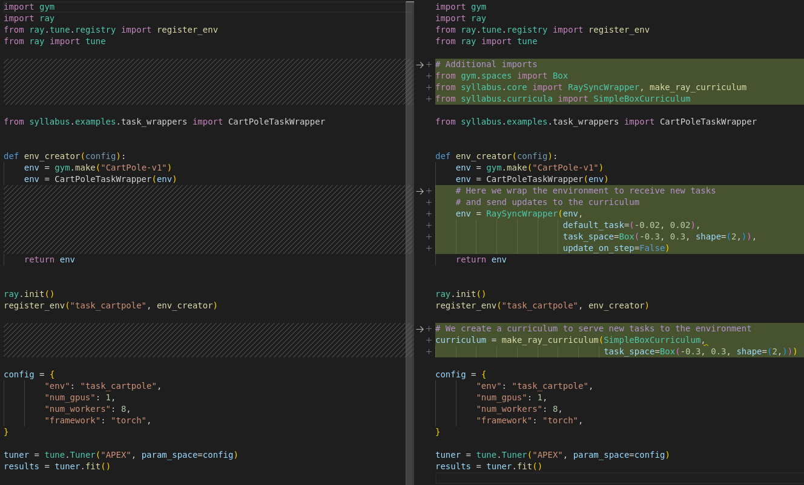

# Syllabus

Syllabus is an API for designing curricula for reinforcement learning agents, as well as a framework for synchronizing those curricula across environments running in multiple processes. Curriculum Learning in some form has been behind many of the greatest successes in reinforcement learning, so Syllabus is designed to make those methods more accessible to researchers. It currently supports running environments with Python native multiprocessing or Ray actors, which includes RL libraries such as RLLib, CleanRL, Stable Baselines 3, and Monobeast (Torchbeast). We currently have working examples with **CleanRL**, **RLLib**, and **Monobeast (Torchbeast)**. We also have preliminary support and examples for multiagent **PettingZoo** environments.

WIP Documentation is available at https://ryannavillus.github.io/Syllabus/index.html

## Installation

You can install the pip package with:
```
pip install Syllabus-RL
```

Or for the latest changes you can install from the repository directly;
```
git clone https://github.com/RyanNavillus/Syllabus.git
cd Syllabus
pip install -e .
```


## How it works

Syllabus's multiprocessing infrastructure uses a bidirectional sender-receiver model in which the curriculum sends tasks and receives environment outputs, while the environment receives tasks and sends outputs. The environment can run the provided task in the next episode and the curriculum can use the outputs to update its task distribution. You can also update the curriculum directly from the main learner process to incorporate training information. Adding Syllabus's functionality to existing RL training code requires only a few additions.

To use syllabus for your curriculum learning project you need an environment that supports multiple tasks, then you need can create:

* A `TaskSpace` object that defines the range of tasks that you want your curriculum to support. In most cases these are simple Discrete or Box spaces.
* A curriculum that subclasses `Curriculum` or follows its API. Many of these are already provided by Syllabus.
* Either an environment that subclasses `TaskEnv` or a wrapper that subclasses `TaskWrapper` allowing you to set a new task on `reset()`. Examples and generic implementations are available in Syllabus.

If your RL learning code uses python native multiprocessing or ray actors to parallelize environments, then all of the global coordination is handled automatically by Syllabus's synchronization wrappers.

## Example

This is a simple example of using Syllabus to synchronize a curriculum for CartPole using RLLib. CartPole doesn't normally support multiple tasks so we make a slight modification, allowing us to change the initialization range for the cart (the range from which the cart's initial location is selected). We also implement a `SimpleBoxCurriculum` which increases the initialization range whenever a specific reward threshold is met. We can use the `TaskWrapper` class to implement this new functionality for CartPole and allow us to change the task on `reset()`.

```python
from syllabus import TaskWrapper


class CartPoleTaskWrapper(TaskWrapper):
    def __init__(self, env):
        super().__init__(env)
        self.task = (-0.02, 0.02)
        self.total_reward = 0

    def reset(self, *args, **kwargs):
        self.env.reset()
        self.total_reward = 0
        if "new_task" in kwargs:
            new_task = kwargs.pop("new_task")
            self.change_task(new_task)
        return np.array(self.env.state, dtype=np.float32)

    def change_task(self, new_task):
        low, high = new_task
        self.env.state = self.env.np_random.uniform(low=low, high=high, size=(4,))
        self.task = new_task

    def _task_completion(self, obs, rew, term, trunc, info) -> float:
        # Return percent of optimal reward
        self.total_reward += rew
        return self.total_reward / 500.0
```


With just a few modifications to our base learning code, we can train an agent with a curriculum that's globally synchronized across multiple parallel environments.



As you can see, we just wrap the task-enabled CartPole environment with a `RaySyncWrapper`, then create a curriculum and wrap it with the `make_ray_curriculum()` function. They automatically communicate with each other to sample tasks from your curriculum, use them in the environments, and update the curriculum with environment outputs. That's it! Now you can implement as many curricula as you want, and as long as they follow the `Curriculum` API, you can hot-swap them in this code. Syllabus allows you to ignore the multiprocessing and focus on developing environments or curriculum learning methods. If you find that the existing multiprocessing infrastructure doesn't serve your use case well enough, please [create an issue](https://github.com/RyanNavillus/Syllabus/issues/new/choose) so that we can work with you to support it.

For more examples, take a look at our examples folder. We currently have [examples](https://github.com/RyanNavillus/Syllabus/tree/main/syllabus/examples) for the following combinations of RL components:

| RL Library    | Environment                       | Curriculum Method         |
| --------------|-----------------------------------|---------------------------|
| CleanRL       | CartPole-v1 (Gym)                 | SimpleBoxCurriculum       |
| CleanRL       | MiniHack-River-v0 (Gym API)       | PrioritizedLevelReplay    |
| CleanRL       | Pistonball-v6 (Pettingzoo)        | SimpleBoxCurriculum       |
| RLLib         | CartPole-v1 (Gym)                 | SimpleBoxCurriculum       |
| TorchBeast    | NetHackScore-v0 (Gym API)         | LearningProgress          |

If you write any new examples and would like to share them, please create a pull request!


# Custom Curricula and Environments

To create your own curriculum, all you need to do is write a subclass of Syllabus's `Curriculum` class. `Curriculum` provides multiple methods for updating your curriculum, each meant for a different context. By subclassing the `Curriculum` class, your method will automatically work with all of Syllabus's provided tools and infrastructure. Details on implementing your own curriculum can be found on the [documentation wesbite](https://ryannavillus.github.io/Syllabus/curricula/custom_curricula.html).

To write a custom task wrapper for an environment, simply subclass the `TaskWrapper` for gym environments or `PettingZooTaskWrapper` for pettingzoo environments. More information can be found at [documentation wesbite](https://ryannavillus.github.io/Syllabus/task_spaces/custom_taskwrapper.html). 

## Task Spaces
Syllabus uses task spaces to define valid ranges for tasks and simplify some logic. These are [Gym spaces](https://gymnasium.farama.org/api/spaces/) which support a majority of existing curriculum methods. For now, the code thoroughly supports Discrete and MultiDiscrete spaces with preliminary support for Box spaces. The task space is typically determined by the environment and limits the type of curriculum that you can use. Extra warnings to clarify these limitations will be added in the future. Most curricula support either a discrete set of tasks or a continuous space of tasks, but not both.


## Optimization
There is a cost to synchronizing separate processes. To minimize this we batch environment step updates, and each communication channel updates independently. That being said, there is still a lot of room to optimize Syllabus. Here is the current speed comparison of environment stepping with and without Syllabus:
```
Relative speed of native multiprocessing with Syllabus: 74.67%
Relative speed Ray multiprocessing with Syllabus: 70.17%
Relative speed of native multiprocessing with Syllabus (no step updates): 90.46%
Relative speed Ray multiprocessing with Syllabus (no step updates): 89.34%
```
As you can see, step updates contribute to a significant slowdown. Not all curricula require individual step outputs, so you can disable these updates in the environment sync wrapper by initializing it with `update_on_step=False`.

Note: This setup means that the environment might sample tasks from the curriculum before the data from its previous episode has been procesed. We assume that this slight delay is inconsequential to most curriculum learning methods.


# Supported Automatic Curriculum Learning Methods:
To help people get started using Syllabus, I've added a few simple curriculum learning methods and some popular baselines (namely Prioritized Level Replay). Below is a full table of supported methods. If you use these methods in your work, please be sure to cite Syllabus as well as original papers and codebases for the relevant methods.

| Method                                | Original Implementation/Citation                  |
| ------------------------------------- | -----------                                       |
| Prioritized Level Replay (PLR)        | https://github.com/facebookresearch/level-replay  |
| Learning Progress                     | https://arxiv.org/abs/2106.14876                  |
| SimpleBoxCurriculum                   |                                                   |


# Documentation

To build the documentation, run the following commands:

```
sphinx-build -M html ./docs/source ./docs
cp -r ./docs/html/* ./docs && rm -R ./docs/html/*
```

Then you can view it at docs/html/index.html

If you need to regenerate the module docs from scratch, you can use the following:
```
sphinx-apidoc -o ./docs/modules ./syllabus
```

## Citing Syllabus
To be added soon.
