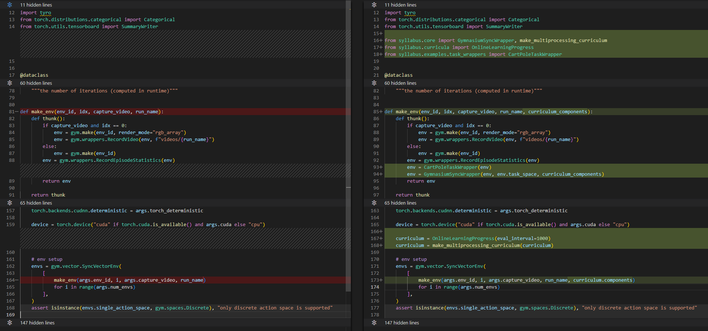
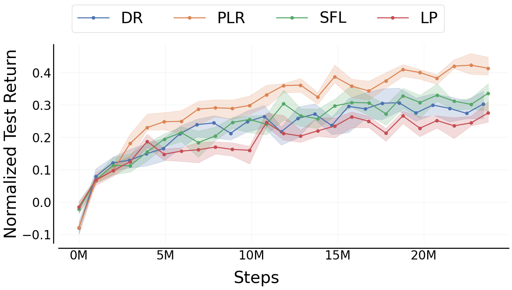
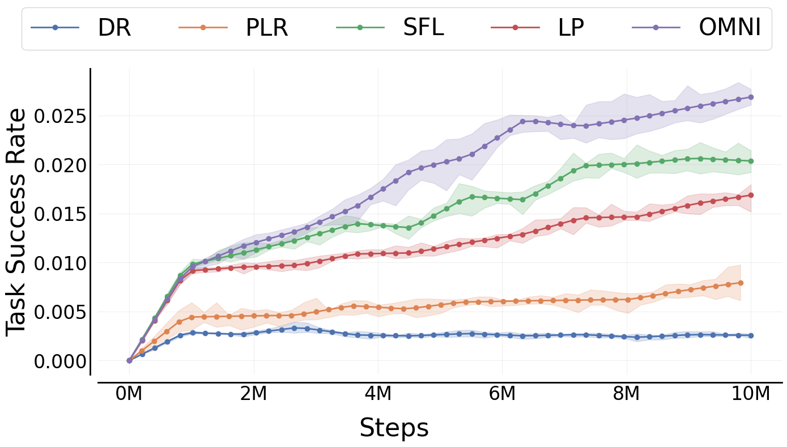
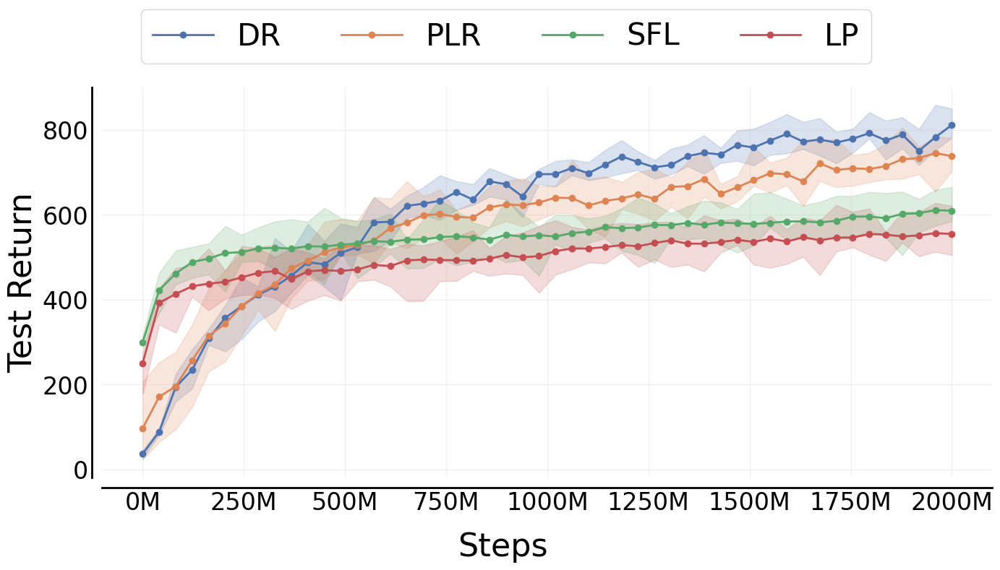
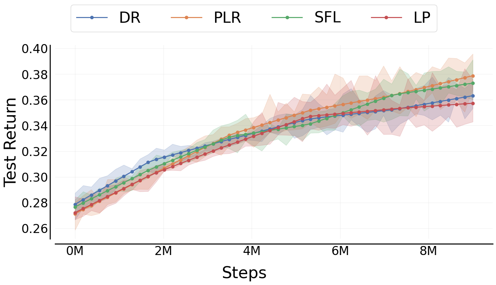

# Syllabus
## Outstanding Paper Award in Tooling, Environments, and Evaluation for Reinforcement Learning at RLC 2025!

Syllabus is a portable library for training reinforcement learning (RL) agents with curriculum learning. It provides a flexible API for defining curricula, a collection of popular automatic curriculum algorithms, and infrastructure for synchronizing curricula with feedback from environments running across multiple processes. Unlike most curriculum learning implementations, which tightly couple policy training with curriculum logic and rely on algorithm‑specific multiprocessing systems, Syllabus separates curriculum design from the rest of the RL pipeline. This modular design makes it easy to integrate curriculum learning into existing training pipelines across nearly any RL library.

Syllabus supports both Python native multiprocessing and Ray actors, and has been tested with **CleanRL**, **PufferLib**, **RLLib**, **Stable Baselines 3**, **TorchAC**, and **Moolib**. It also offers native support for multi‑agent **PettingZoo** environments.

For a quick look at how to use Syllabus, check out the [demo script](https://github.com/RyanNavillus/Syllabus/blob/main/demo.py) or [demo notebook](https://colab.research.google.com/drive/1GWfBdZRx-ifOUKcBhPuZTzFFy5CvKFu6?usp=sharing) in Google Colab.

See the paper for more information and baselines: https://arxiv.org/abs/2411.11318

Documentation can be found at at https://ryannavillus.github.io/Syllabus/index.html

# Why Curriculum Learning?
Curriculum learning is a class of methods which, broadly speaking, modify the training environment from the agent's perspective. This could mean creating progressively larger mazes for an agent to escape, playing aginst increasingly challenging opponents in a competitive game, or rewarding an agent for finding items in a videogame based on how frequently it encounters them. These methods can improve sample efficiency, encourage the discovery of new skills, or make agents more robust to diverse scenarios. Curriculum learning in some form has been behind many of the greatest successes in reinforcement learning. For instance, self-play produces an implicit curriculum of increasingly skilled opponents, and was a core component of AlphaGo, AlphaStar, and GT Sophy. OpenAI Five was trained with extensive domain randomization using expert-designed ranges across most facets of the Dota 2. GT Sophy was trained on a manually curated distribution of scenarios to prioritize challenging sections of each race track.

Automatic curriculum learning methods attempt to automatically select the task that will maximize sample efficiency toward strong general performance. These methods typically use heuristics based on the agent's current performance to identify tasks in the agent's zone of proximal development, meaning tasks that provide the highest learning signal based on the agent's current capabilities. This can be framed in many ways, such as choosing tasks that are hard yet solvable, or tasks that the agent has recently shown increased aptitude toward, or tasks that maximize regret.


## Installation

You can install the pip package with:
```
pip install syllabus-rl
```

There are also optional dependencies for running test cases and compiling documentation, which can be installed with the 'test' or 'docs' options respectively. You can install both with:
```
pip install syllabus-rl['all']
```

For the latest changes you can install from the repository directly;
```
git clone https://github.com/RyanNavillus/Syllabus.git
cd Syllabus
pip install -e .
```

If you want to modify Syllabus for your own use case, we recommend forking the library and then cloning it so that you can PR your changes to our repo in the future.

## How it works

Syllabus creates a bidirectional communication pathway between a `Curriculum` object and an environment wrapper. This allows the curriculum to directly send new tasks to the environment after each `reset()`, while the environments send metrics and feedback for each task back to the `Curriculum`. The curriculum uses this feedback to automatically update its task sampling distribution. You can also update the curriculum directly from the main process to incorporate information from the training process. This separate communication pathway means that adding Syllabus's functionality to existing RL training code requires only a few additions.

When the environment's `reset()` function is called, which is typically done automatically by the vector environment, the environment synchronization wrapper will pull a task from the current queue and ask the curriculum to sample another task using the `sample()` method. This ensures that the environment does not need to wait for the curriulum to sample a new task to begin collecting samples. Depending on the curriculum that you choose, the environment will prepare feedback for curriculum after every step, after each completed task, or after every episode. These updates are batched and sent every N steps, or at the end of an episode, whichever happens first. The curriculum synchronization wrapper receives these updates and automatically calls the `Curriculum` object's `update_on_step()`, `update_on_episode()`, and `update_task_progress()` methods. Every part of the process occurs automatically once you have initialized and configured the curriculum, so you do not need to modify any other training code to use Syllabus.

To use curriculum learning in your project you need an environment that supports multiple tasks. To use Syllabus you will need to create:

* A `TaskSpace` object that defines the range of tasks that your `Curriculum` will sample from.
* A `Curriculum` object. Syllabus provides several implementations, but you can also create your own by extending the `Curriculum` class.
* Either an environment that subclasses `TaskEnv` or a wrapper that subclasses `TaskWrapper` allowing you to set a new task on `reset()`. 

Examples and generic implementations of all of these components are available in Syllabus.

If your RL learning code uses python native multiprocessing or ray actors to parallelize environments, then all of the global coordination is handled automatically by Syllabus's synchronization wrappers.

## Example

This is a simple example of using Syllabus to synchronize a curriculum for CartPole using CleanRL. CartPole doesn't normally support multiple tasks so we make a slight modification, allowing us to change the initialization range for the cart (the range from which the cart's initial location is selected). We use the OnlineLearningProgress curriculum to automatically select this range during training. We can use the `TaskWrapper` class to implement this new functionality for CartPole, making it possible to change the task during each `reset()`.

```python
from syllabus.core import TaskWrapper
from syllabus.task_space DiscreteTaskSpace

class CartPoleTaskWrapper(TaskWrapper):
    def __init__(self, env):
        super().__init__(env)
        self.task_space = DiscreteTaskSpace(10)
        self.task = (-0.02, 0.02)
        self.total_reward = 0

    def reset(self, **kwargs):
        self.total_reward = 0
        if "new_task" in kwargs:
            new_task = kwargs.pop("new_task")
            new_task = (3 * new_task / 50.0) - 0.3  # [-0.3, 0.3]
            new_task = (new_task, new_task)
            self.task = new_task

        return self.env.reset(options={"low": -abs(self.task[0]), "high": abs(self.task[1])})

    def _task_completion(self, obs, rew, term, trunc, info) -> float:
        self.total_reward += rew
        return self.total_reward / 500.0
```


With just a few modifications to our base learning code, we can train an agent with a curriculum that's globally synchronized across multiple parallel environments. You can find the full file [here](https://github.com/RyanNavillus/Syllabus/tree/main/syllabus/examples/cleanrl_cartpole.py).




As you can see, we can start using curriculum learning with less than 10 lines of code, and without modifying any training or multiprocessing logic. First we create an `OnlineLearningProgress` curriculum and allow it to send tasks to the environment with the `make_multiprocessing_curriculum()` function. Next we enable task-swapping by wrapping the CartPole environment with our `CartPoleTaskWrapper`, then allow it to communicate with the curriculum by wrapping it in a `GymnasiumSyncWrapper` and providing the curriculum components, which contain the necessary multiprocessing queues. With those steps done, the curriculum and environments will automatically communicate with each other! You can easily swap out the curriculum for a different option (see our [procgen example](https://github.com/RyanNavillus/Syllabus/blob/7e8ca8960d7d9ff79a60a2f82a2f926708b8e371/syllabus/examples/training_scripts/cleanrl_procgen.py#L278)) or implement your by following the `Curriculum` API. Syllabus allows you to ignore complex multiprocessing logic and focus on research. If you find that the existing multiprocessing infrastructure doesn't fit your use case, please [create an issue](https://github.com/RyanNavillus/Syllabus/issues/new/choose) so that we can work with you to support it.

For examples of how to use Syllabus with various RL libraries, take a look at our [examples](https://github.com/RyanNavillus/Syllabus/tree/main/syllabus/examples) folder. We also have examples that run but that have not been verified against published results in the [experimental](https://github.com/RyanNavillus/Syllabus/tree/main/syllabus/examples/experimental) folder.

# Implemented Automatic Curriculum Learning Methods:
Syllabus includes implementations of several automatic curriculum learning algorithms, as well as tools for manually designing curricula. Below is a full table of supported methods. If you use these methods in your work, please be sure to cite Syllabus as well as their original papers.

| Method                                                                | Paper                                             |   Codebase                                                  |
| --------------------------------------------------------------------- | ------------------------------------------------- | ----------------------------------------------------------- |
| Prioritized Level Replay (PLR)                                        | https://arxiv.org/abs/2010.03934                  | https://github.com/facebookresearch/level-replay            |
| Robust Prioritized Level Replay                                       | https://arxiv.org/abs/2110.02439                  | https://github.com/facebookresearch/dcd                     |
| Learning Progress                                                     | https://arxiv.org/abs/2106.14876                  | https://github.com/jennyzzt/omni                            |
| Sampling For Learnability (SFL)                                       | https://arxiv.org/abs/2408.15099                  | https://github.com/amacrutherford/sampling-for-learnability |
| Open-endedness via Models of human Notions of Interestingness (OMNI)  | https://arxiv.org/abs/2306.01711                  | https://github.com/jennyzzt/omni                            |
| Neural Fictitiuous Self-Play                                          | https://arxiv.org/abs/1603.01121                  | -                                                           |
| Prioritized Fictitious Self-Play                                      | https://www.nature.com/articles/s41586-019-1724-z | -                                                           |

# Baselines

You can reference our [paper](https://arxiv.org/abs/2411.11318) for baselines for each automatic curriculum learning algorithm in Syllabus in 4 different environments using 4 different RL libraries. Most of these baselines are in separate codebases originating from other projects:
| RL Library    | Environment                       | Codebase                                                                                                     |
| --------------| --------------------------------- | ------------------------------------------------------------------------------------------------------------ |
| CleanRL       | Procgen (Gym)                     | https://github.com/RyanNavillus/Syllabus/blob/main/syllabus/examples/training_scripts/cleanrl_procgen.py     |
| TorchAC       | Crafter (Gymnasium)               | https://github.com/RyanNavillus/omni/blob/master/train.py                                                    |
| Moolib        | NetHack (Gym)                     | https://github.com/RyanNavillus/nmmo-baselines/blob/syllabus-plr/train.py                                    |
| PufferLib     | Neural MMO 2 (Pufferlib)          | http://github.com/RyanNavillus/dungeonsdata-neurips2022/blob/main/experiment_code/hackrl/experiment.py       |

| Procgen | Crafter |
| :-------: | :-------: |
|  |  |

| Nethack | Neural MMO 2 |
| :-------: | :-------: |
|  |  |

# Documentation

To build the documentation, run the following commands:

```
sphinx-build -M html ./docs-source ./docs
cp -r ./docs/html/* ./docs && rm -R ./docs/html/*
```

Then you can view it at docs/html/index.html

If you need to regenerate the module docs from scratch, you can use the following:
```
sphinx-apidoc -o ./docs-modules ./syllabus
```

You can also run a spell check for the documentation:
```
sphinx-build -b spelling ./docs-source ./docs-spelling
```

## Citing Syllabus

```
@article{sullivan2025syllabus,
  title={Syllabus: Portable Curricula for Reinforcement Learning Agents},
  author={Sullivan, Ryan and P{\'e}goud, Ryan and Rahmen, Ameen Ur and Yang, Xinchen and Huang, Junyun and Verma, Aayush and Mitra, Nistha and Dickerson, John P},
  journal={Reinforcement Learning Journal},
  year={2025}
}
```
